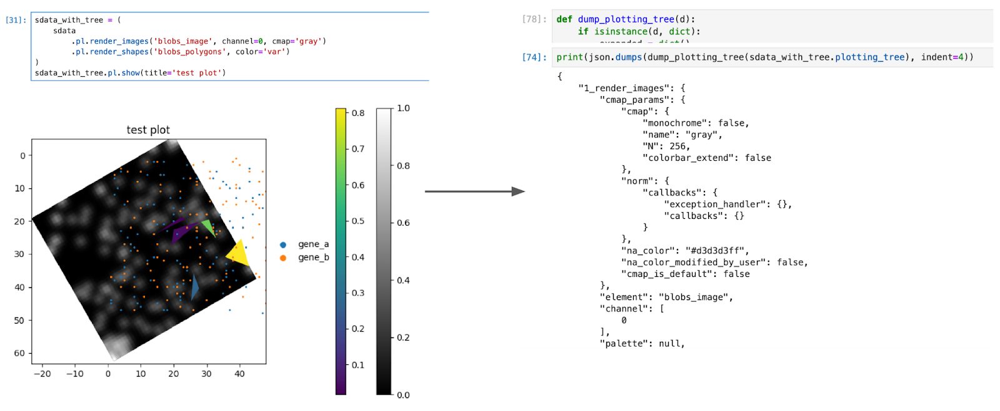
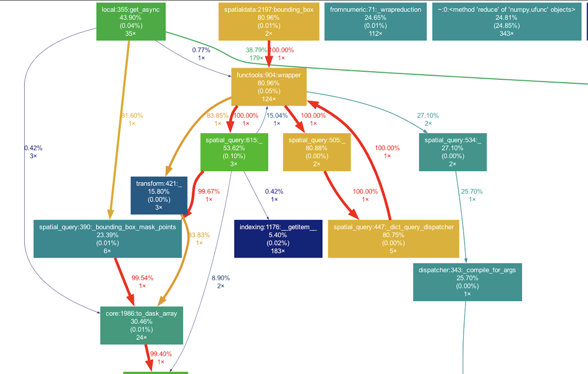

<!-- Note that you can use https://sparontologies.github.io/cito/current/cito.html#objectproperties
for more detailed citations for text mining e.g. [@uses_method_in:marconato_spatialdata_2024] -->

<!-- # Abstract
This pre-print outlines the results of the "1st SpatialData workshop," organized by the SpatialData team and funded by the Chan Zuckerberg Initiative (CZI). The event gathered experts to advance spatial omics through four hackathon tracks: R interoperability, visualization interoperability, scalability and benchmarking, and ergonomics.
Key achievements include integrating R with the SpatialData Python framework, developing a tool-agnostic configuration for visualization, addressing computational bottlenecks, and enhancing usability through improved documentation and interfaces. The workshop fostered collaboration, creating infrastructure prototypes and identifying interoperability challenges. Documented on GitHub, these efforts involved 20 participants from the US and Europe, promoting a FAIR ecosystem of spatial omics tools. -->

# Introduction

This pre-print is aimed at sharing the results of the “1st SpatialData workshop”, an in-person event organized by the SpatialData team and funded by the Chan Zuckerberg Initiative (CZI) that brought together expertise from different fields, including methods developers of a variety of tools for single-cell and spatial omics[@marconatoSpatialDataOpenUniversal2024a]. The purpose is to explore new directions to advance the field of spatial omics. By leveraging multiple programming languages, including Python, R, and JavaScript, the event focuses on four central hackathon tracks:

1. **R interoperability**: This track aims to enhance the integration and compatibility of R and Python with the SpatialData Python framework by using the language-agnostic SpatialData Zarr file format (which follows, when possible, the NGFF specification)[@mooreOMEZarrCloudoptimizedBioimaging2023a], [@mooreOMENGFFNextgenerationFile2021a].  
2. **Visualization interoperability**: This track is dedicated to improving the seamless integration of visualization tools across different systems and programming languages via a tool-agnostic view configuration.  
3. **Scalability and benchmarking**: Participants will identify, benchmark, and address computational bottlenecks within the SpatialData framework.  
4. **Ergonomics and user-friendliness**: This track focuses on enhancing the usability and accessibility of the SpatialData framework for both first-time users and third-party developers.

These tracks aim to foster collaboration and innovation, driving advancements in the analysis and infrastructure of spatial omics and imaging data.

# Results

All the issues were tracked in a public project board accessible here: [https://github.com/orgs/scverse/projects/51/views/1](https://github.com/orgs/scverse/projects/51/views/1).

## R interoperability track

We took a two-sided approach towards facilitating interoperability with Python’s SpatialData: 

- Using existing Python functionality through *reticulate* (e.g., readers and writers  
  for data from different manufacturers, coordinate system alignment etc.) \[[\#66](https://github.com/HelenaLC/SpatialData/pull/66)\]  
- Drafting an out-of-memory representation of SpatialData components in R that relies on a *DelayedArray* (*Rarr*) for .zarr, and an *arrow*\-based interface for Parquet.

A few specific outputs include:

- Making available *scverse*’s example datasets through Bioconductor’s OSN (Open Storage Network), with support for caching using *BiocFileCache* \[[\#58](https://github.com/HelenaLC/SpatialData/pull/58)\]  
- We allow the *anndata*[@Virshup2021.12.16.473007] table in a *SpatialData* object to be read using either *reticulate* and *zellkonverter* or using the *anndataR* package, which relies on a .zarr reader native to R (*pizzarr*). \[[\#62](https://github.com/HelenaLC/SpatialData/pull/62)\]  
- We have implemented an *ImageArray* R class to recognize single- and multi-scale images stored in the SpatialData .zarr store. Multiscale images may be used to pick the optimal resolution for visualization lazily.   
- We have implemented specific *ggplot2*\-based image visualization methods to optimize the plotting of images even further. Transformations are then picked from the .zattrs of the image slot and used to transform the coordinate system of the images. Future work will define further utilities to simultaneously crop and query layers of spatial elements using, e.g., boxes \[[\#73](https://github.com/HelenaLC/SpatialData/pull/73)\].   
- We started with implementing some utility functions to work with annotations and tables. \[[\#74](https://github.com/HelenaLC/SpatialData/pull/74)\]  
- We have a draft vignette to demonstrate the available utilities and visualizations for various spatial technologies using the *SpatialData* Bioconductor class. Such detailed documentation is crucial to onboard new users and developers to join the ongoing effort to improve and complete the class infrastructure.

Taken together, we hope that these efforts will provide a baseline for future developments across the R/Bioconductor community, such as the implementation of statistical methods for these data, visualization suits, and cross-language analysis pipelines that leverage R’s rich ecosystem of statistical methods, and Python for ML-based and imaging analysis. And, ultimately, help bridge the scverse and Bioconductor software ecosystems by making data analysis tools accessible for users of either framework. The current state of matter is available [here](https://github.com/HelenaLC/SpatialData).   
 
). Bottom row, right: MERFISH prototype pipeline, mouse brain [@long2023spacetxroadmapbenchmarkingspatial]](fig1.png)

## Visualization interoperability track

This track focused on enabling visualization tools to interoperate by exchanging configurations using a tool-agnostic format based on a grammar of graphics approach. While in the visualization field there exist approaches with similar goals [@7539624], [@mcnutt2022grammarruleallsurvey], to our knowledge none exist that support multidimensional array-based data such as multi-channel images, nor any that would be able to consider SpatialData-specific metadata such as coordinate systems/transformations. 

We spent the first half of the hackathon discussing considerations for a solution to this problem. We created a list containing, for instance, the fact that users might want to visualize data from multiple SpatialData objects, may want to include multiple subplots, or may want visualization elements such as scale bar dimensions to be relative to figure canvas size.  We also discussed discrepancies between terminology in the different ecosystems and began a glossary to resolve them. Ultimately, visualization interoperability may also include aspects like interactivity.

While keeping these considerations in mind, we began by narrowing our scope to focus on the interoperability of figures that can already be generated using the `spatialdata-plot` library. We used the existing spatialdata-plot API to construct a basic figure using the \`blobs\` example SpatialData object, with the figure containing one image channel, shapes, and points (colored by a table column). Next, we converted the “plotting tree” representation used by spatialdata-plot internally to a Python dictionary which we subsequently saved as JSON.

We compared this plotting tree JSON representation and an example Vega JSON specification in side-by-side text editors. Step-by-step, we identified analogous concepts between spatialdata-plot and Vega and adopted the Vega keywords and terminology where possible. We can now consider this more Vega-like representation of the plotting tree as a target interoperable representation for the ecosystem of SpatialData visualization tools to communicate.

We spent the second half of the hackathon completing independent tasks in parallel with the goal of developing a Python package containing utilities for conversion of the interoperable visualization config format. We created a GitHub repository for this package and compiled a list of follow-up tasks ([https://github.com/keller-mark/spatialdata-vis-interop/issues](https://github.com/keller-mark/spatialdata-vis-interop/issues)). These include testing “roundtrip” processes that begin with a tool-specific configuration, convert to the tool-agnostic representation, and finally convert back to the tool-specific format. Both at the configuration and the visualization levels these representations should match to achieve interoperability. Between tools, we acknowledge that there will be slight differences in visual representations, but core aspects such as coordinate transformations should match.  

## Benchmarking and scalability track

This track focused on Identifying, benchmarking, and addressing computational bottlenecks in the SpatialData framework. Toward this goal, we curated a list of 12 issues related to scalability and performance, ranging from new documentation to specific code optimizations. An initial introduction slide deck introduces the various issues and possible solutions. We discuss 5 specific contributions:

The developer documentation of SpatialData was extended to include links to learning resources. We also worked on a more general and up-to-date profiling and performance in Python guide, based on the practical experiences of the developers present at the hackathon. [hackmd](https://hackmd.io/@D9GB-ZDcTQyFd7U5aMmk5g/ryY8fngfkx)   
[https://gist.github.com/Czaki/430a3b59e1a174e34401c37035c1529c](https://gist.github.com/Czaki/430a3b59e1a174e34401c37035c1529c). 

SpatialData makes use of Dask for code parallelism. New documentation was added to showcase working with an explicit Dask cluster and worker management, linking heavy computational analysis workflows in Dask and the official Dask Performance documentation. [https://github.com/scverse/spatialdata/issues/768](https://github.com/scverse/spatialdata/issues/768). 

In order to benchmark at a sufficient scale, a performant artificial dataset needed to be created. Napari met such a challenge in the past so its [code](https://github.com/napari/napari/blob/main/napari/benchmarks/utils.py) was used as inspiration to create datasets better reflecting typical large spatialdata object. Using these new benchmark functions, an initial benchmark suite was setup using the airspeed-velocity framework ([asv](https://github.com/airspeed-velocity/asv/)) in [\#784](https://github.com/scverse/spatialdata/pull/784).

As a first benchmarking example, we reproduced an observed problem of performance when subsetting objects with many points using query methods. These query methods were benchmarked with and without table and points elements and using the new artificial datasets ranging from image size (100, 1000, 10\_000). This gave a test that reproduced the behavior seen in the real-world Xenium example dataset. It allows testing new solutions such as using spatial indexing and also lays the groundwork for additional benchmark tests. 

Using the cProfile package from Python, we’ve managed to identify the slowness caused by the querying step of \`points\` element. The simple but dirty solution is to subset \`points\` before querying ([\#777](https://github.com/scverse/spatialdata/pull/777)). In the long term, we have several options. One will be indexing the points element properly, so each query won’t need to look through the whole object to fetch a small bit. This part was partially discussed in the hackathon. The other solution is to do the querying in parallel. And this can happen internally inside the spatialdata package using Dask or externally e.g. one thread query in a subset of the whole SpatialData object. We’ve chosen to implement the later version. It was implemented as a [subworkflow](https://github.com/BioinfoTongLI/modules/blob/develop/subworkflows/sanger/parallelspatialdataquery/main.nf) in Nextflow.  

## Ergonomics and user-friendliness track

In the hackathon, we've focused on making the SpatialData framework more accessible. We've organized the documentation with distinct notebooks for beginners, intermediate, and advanced users, and improved the ergonomics of existing methods. These efforts aim to simplify the learning process and enhance usability for all users.

**Documentation**  
The SpatialData documentation covers a wide range of topics but can be too technical for newcomers to the field. A goal of this hackathon was to create some new basic tutorials to get starters used to the data format and basic SpatialData functionality. Therefore, we added a new “Intro to SpatialData” tutorial introducing common tasks like reading/writing, plotting, querying, and navigating the SpatialData object. This serves as a hub for users to discover more advanced functionality as needed.

In the process, we found ourselves needing a new, small yet relevant biological dataset for tutorials to make them more applicable to end-users. A dataset of healthy mouse liver from molecular cartography was chosen[@GUILLIAMS2022379], after being processed and annotated by SPArrOW[@Pollaris2024.07.04.601829]. 

The latter dataset was used to update the transformation notebook to use a biologically relevant dataset instead of the “raccoon” example (scipy.[misc.face](https://docs.scipy.org/doc/scipy/reference/generated/scipy.misc.face.html#scipy.misc.face)()). We also split this tutorial into two: a basic one, and an intermediate one. See [the PR here](https://github.com/scverse/spatialdata-notebooks/pull/125).

For consistency, the same dataset was used to create a draft of a new annotation notebook that explains following aspects (issue [\#749](https://github.com/scverse/spatialdata/issues/749)): 

- Adding spatial structures and annotations for these structures  
- Create an anndata table summarizing the gene expression per cell  
- Annotating the cells in the anndata object 

A mock-up for a second dataset has been made, but this will be future work. 

As further improvements to the docs, we added a glossary to the spatialdata docs so that a new user can have a quick look to any term that he doesn’t know yet, such as IO, ROI, NGFF, Zarr, raster, vector, elements. See [this PR](https://github.com/scverse/spatialdata/pull/785).

For better findability of existing functions, we refactored the display of the API reference. Notably, we now display on the left navigation bar different groups of functions (e.g., SpatialData object, Operations, Transformations, …), while the right navigation bar shows function to navigate through one specific section easily. We also made some minor docs updates, such as improving the docstrings of the query operations. See the above PR.

**Ergonomics**  
A CLI was added to spatialdata-io which allows users to access all readers via command line. For any technology that already had a reader available it is now possible to read the corresponding files into a spatialdata object and write them to a Zarr store with one command. A CLI interface for MCMICRO processed data was also added for interoperability with existing community supported Nextflow pipeline[@schapiroMCMICROScalableModular2022]. In addition, a CLI for loading generic shape objects in form of .geojson files and images in .tiff and .png format was added to load and write into an existing or new zarr store. 

For convenience, we added a mirror so that spatialdata.io calls spatialdata-io under the hood. If spatialdata-io is not installed, it will raise an error only if a reader is called and the error message details that spatialdata-io should be installed (e.g., via pip). See [this PR](https://github.com/scverse/spatialdata/pull/778).

Finally, within spatialdata-io, we finished updating the seqfish reader (adapted to new output format). Now accounts for different prefixes in filenames, reads scalefactor from DAPI image, can load additional shapes and has more flexible file readers.  

![Visualization of the new lightweight mouse liver dataset used in the documentation[@GUILLIAMS2022379]. Molecular cartography dataset, processed using SPArrOW[@Pollaris2024.07.04.601829].](fig4.png)

## Brainstorming sessions

We also had brainstorming sessions combining people across different groups, described below.

### Store-wide metadata for provenance information (technology, tissue, donor etc.)

We identified the need to store provenance information (technology, tissue, donor, etc) and software metadata (e.g. created and used by SOPA) at the root level of a Zarr SpatialData object. For this a PR (opened before) has been worked on during the hackathon [https://github.com/scverse/spatialdata/pull/711](https://github.com/scverse/spatialdata/pull/711).

### Representing relationships between cells/compartments/transcripts/etc.

Many tools downstream of SpatialData see the need to store relationship information regarding spatial organization between the entities. Such as which points overlap the cells or what the distance between cells is. This amount to find the right balance between the power of a fully-fledged relational database, which would be a cumbersome over-solution for cases where we need to merge two .csv files, and a restricted but ergonomic solution, like AnnData. We concluded that an effective way to proceed is not to endorse/design an approach but provide a public and collaborative list (as a “GitHub Discussion” in the spatialdata repository) to list and existing methods and point to existing code showing their solution. Some of the solutions is to add metadata to the tables (e.g. columns “belong\_to\_cell\_x” and “sample\_y”), a sparse graph representation. Other methods just compute the relationships on-the-fly and do not serialize the results but discard them after using them. [https://github.com/scverse/spatialdata/discussions/788](https://github.com/scverse/spatialdata/discussions/788) 

### SpatialData in the cloud

We had a conversation on how to store large collections of SpatialData objects in the cloud. The limiting factors that require extra work are: an optimized/indexed storage format for vector geometries–spatial partitioning handled by dask-geopandas seems to be a solution, and metadata storage.

# Conclusions

The hackathon brought together 20 participants from institutions across the US and Europe, who collaboratively enhanced the usability and interoperability of the SpatialData format and framework. A key achievement was the development of infrastructure prototypes to integrate SpatialData with other frameworks, while also identifying technical challenges that hinder cross-language interoperability. These results, along with new ideas and outstanding tasks, are documented in GitHub issues for further development. In conclusion, we are excited to continue fostering collaboration among communities of analysts, developers, and biologists, advancing towards a FAIR ecosystem of spatial omics tools that bridges diverse expertise and promotes seamless interoperability.

# Acknowledgements

The event was made possible thanks to the support of the Chan Zuckerberg Initiative DAF, via the Single Cell Data Insights Cycle 2 grant.

# References

